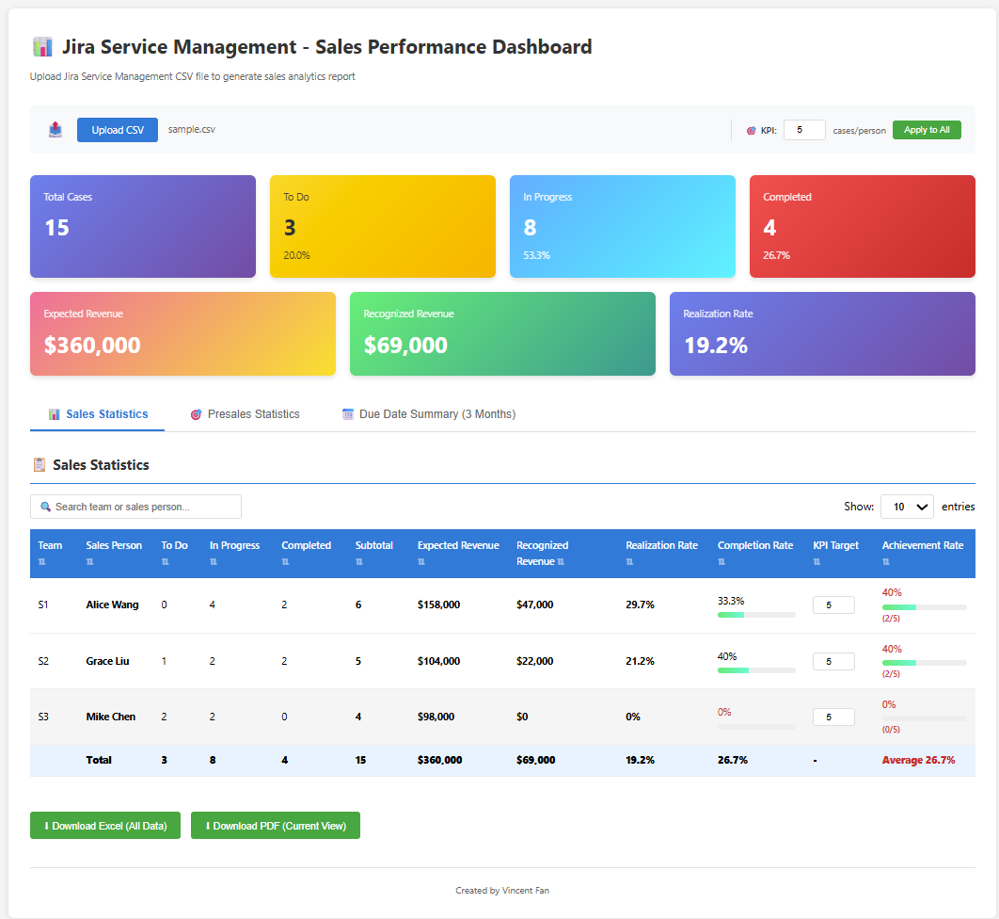

# Jira Service Management - Sales Performance Dashboard

A powerful, interactive dashboard for analyzing Jira Service Management sales data with advanced filtering, sorting, and visualization capabilities. Track sales performance, presales activities, technical support workload, and project due dates in real-time.


## 📸 Screenshot



## ✨ Features

### 📊 Multi-Tab Analytics
- **Sales Statistics**: Track sales team performance with individual KPI settings (default KPI: 5)
- **Presales Statistics**: Monitor presales team workload with KPI support (default KPI: 8)
- **Technical Support Statistics**: Track technical support team workload with KPI support (default KPI: 8)
- **Due Date Summary**: View upcoming deadlines with customizable time range (1-24 months, default: 3 months)

### 🎯 Key Capabilities
- **Customizable KPIs**: Set individual or global KPI targets for each team member within their respective tabs
- **Advanced Filtering**: Search, sort, and filter data across all tables
- **Real-time Statistics**: Dynamic stat cards showing filtered vs. total data
- **Revenue Tracking**: Monitor expected and recognized revenue with realization rates (Sales tab)
- **Progress Visualization**: Color-coded completion bars and achievement rates
- **Data Persistence**: KPI settings saved to browser localStorage
- **Flexible Date Range**: Adjust Due Date Summary to show 1-24 months of upcoming deadlines
- **Mobile Responsive**: Optimized layout for phones and tablets
- **Interactive Tooltips**: Context-sensitive help icons (ℹ) next to each tab title explaining tab purposes, usage, and features with auto-wrapping text display

### 📥 Export Options
- **PDF Export**: Download current view with applied filters (print-friendly)
- **Excel Export**: Export all data to a multi-sheet workbook
  - Sheet 1: Sales Statistics
  - Sheet 2: Presales Statistics
  - Sheet 3: Technical Support Statistics
  - Sheet 4: Due Date Summary (reflects your Display Months setting)
- **HTML Export**: Generate professional complete report
  - Executive Summary with key metrics
  - All 4 sections with full data (no pagination)
  - Sales/Presales/TS tables sorted by Achievement Rate (highest first)
  - Due Date Summary reflects your Display Months setting
  - Suitable for management presentations

## 🚀 Quick Start

### 1. Download
Simply download `index.html` - it's a standalone file with no dependencies!

### 2. Open
Open the HTML file in any modern web browser (Chrome, Firefox, Edge, Safari).

**Or use GitHub Pages**: https://whfan0827.github.io/jsm-sales-performance-dashboard/

### 3. Upload CSV
Click "Upload CSV" and select your Jira Service Management export CSV file.

### 4. Analyze
Switch between tabs, set KPIs, apply filters, and export reports!

## 📋 CSV Format

The dashboard expects a Jira Service Management CSV export with the following columns:

### Required Columns
- `Issue key` - Jira issue identifier
- `Issue id` - Issue ID
- `Summary` - Issue description
- `Status` - Current status (e.g., Done, 3-Design, 5-Build)
- `Custom field (MMPJ_MCI_Sales)` - Sales person name
- `Custom field (MMPJ_MCI_SalesTeamID)` - Sales team ID
- `Custom field (MMPJ_MCI_funding(num))` - Expected revenue/funding amount
- `Due date` - Issue due date

### Optional Columns
- `Custom field (MMPJ_MCI_PS)` - Presales personnel (supports multiple values)
- `Custom field (MMPJ_MCI_TS)` - Technical Support personnel (supports multiple values)
- Additional custom fields as needed

See `sample.csv` for a complete example.

## 🎨 Status Classification

The dashboard automatically classifies Jira Service Management statuses into three categories:

- **ToDo** (Yellow): Status starting with 0, 1, 2, or "To Do"
- **InProgress** (Blue): Status starting with 3-9
- **Done** (Red): Status is "Done"

## 👥 Multi-Personnel Support

The dashboard supports multiple personnel assignments for Presales and Technical Support:

- **Sales**: Single assignment per case
- **Presales**: Supports multiple personnel per case (cases are counted for each assigned person)
- **Technical Support**: Supports multiple personnel per case (cases are counted for each assigned person)

This allows accurate workload tracking when multiple team members collaborate on the same case.

## 💡 Usage Tips

### Understanding Tabs
Hover over the ℹ icon next to each tab title to see detailed information about:
- **Sales Statistics**: Revenue tracking, KPI settings, and team performance metrics
- **Presales Statistics**: Workload monitoring with multi-personnel support
- **Technical Support Statistics**: Support team workload and completion tracking
- **Due Date Summary**: Project deadline overview with customizable time ranges

### Setting KPIs
1. **Individual KPI**: Click the number in the "KPI Target" column for any person
2. **Tab-Specific Global KPI**: Each tab (Sales, Presales, Technical Support) has its own KPI setting
   - Sales default: 5 cases/person
   - Presales default: 8 cases/person
   - Technical Support default: 8 cases/person
3. **Apply to All**: Use the KPI input in each tab and click "Apply to All" to set the same KPI for all team members in that tab

### Filtering Data
- Use the search box to filter by name or team
- Click column headers to sort ascending/descending
- Adjust "Show" dropdown to change page size

### Exporting Reports
- **PDF**: Exports only the currently visible tab with current filters applied
- **Excel**: Exports all data from all four tabs (Sales, Presales, Technical Support, Due Date Summary)
- **HTML**: Generates a professional complete report with:
  - Executive Summary section with aggregated metrics
  - All personnel from Sales/Presales/Technical Support (no pagination)
  - Data sorted by Achievement Rate for easy performance review
  - Due Date Summary with your selected month range
  - Print-optimized formatting for management presentations

## 📱 Mobile Support

Fully responsive design optimized for:
- 📱 Smartphones (portrait & landscape)
- 📱 Tablets
- 💻 Desktop browsers

Features on mobile:
- Touch-friendly horizontal scrolling for wide tables
- Optimized font sizes and spacing
- Stacked layout for controls and cards
- Tab buttons wrap automatically

## 🔧 Browser Compatibility

- ✅ Chrome 90+
- ✅ Firefox 88+
- ✅ Edge 90+
- ✅ Safari 14+
- ✅ Mobile browsers (iOS Safari, Chrome Mobile)

## 📊 Sample Data

Use `sample.csv` to test the dashboard features:

```bash
# Simply upload sample.csv to see the dashboard in action
# Contains 15 sample projects with realistic data
```

## 🛠️ Technical Details

### Technologies Used
- Pure HTML/CSS/JavaScript (no framework dependencies)
- [SheetJS](https://sheetjs.com/) for Excel export
- LocalStorage API for data persistence
- CSS Grid & Flexbox for responsive layout

### File Size
- HTML: ~112 KB (single file, includes all functionality)
- No external dependencies required at runtime
- SheetJS library loaded from CDN for Excel export
- Fully self-contained with mobile-responsive CSS and intelligent tooltips

### Recent Updates (v1.1)
- Enhanced tab tooltips with context-sensitive help
- Improved tooltip design with auto-wrapping for better readability
- Optimized mobile date parsing for broader browser compatibility

## 📝 Customization

### Modify Status Classification
Edit the `classifyStatus()` function in the HTML file:

```javascript
function classifyStatus(status) {
    if (!status) return null;

    const statusLower = status.toLowerCase();
    if (statusLower === 'done') return 'Done';

    const firstChar = status[0];
    if (['0', '1', '2'].includes(firstChar)) return 'ToDo';
    if (['3', '4', '5', '6', '7', '8', '9'].includes(firstChar)) return 'InProgress';

    return null;
}
```

### Change Color Scheme
Modify the `.stat-card` CSS classes to customize colors:

```css
.stat-card.todo {
    background: linear-gradient(135deg, #ffd93d 0%, #ffb700 100%);
}
```

## 🤝 Contributing

Contributions are welcome! Feel free to:
- Report bugs
- Suggest new features
- Submit pull requests

## 📄 License

MIT License - feel free to use this project for personal or commercial purposes.

## 🙏 Acknowledgments

Built with modern web standards and best practices for a smooth user experience.

---

**Note**: This dashboard processes all data locally in your browser. No data is sent to external servers, ensuring complete privacy and security.
